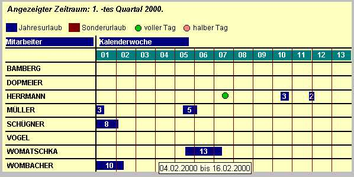



## TimeChart Pro

### Description

Mit diesem OCX können Zeiträume grafisch dargestellt werden, z.B. für Urlaubsübersichten oder Projektzeitpläne.

Farben, Inhalte und Beschriftung sind leicht änderbar. Automatischer Scrollbalken beim verkleinern.

Neben dem SourceCode ist noch ein gut dokumentiertes Beispiel enthalten. Voraussetzung ist eine Access-Datenbank (mdb)
 
### More Info
 

             |
---                |---
**Submitted On**   |2000-06-13 18:05:34
**By**             |[Axel Womatschka](https://github.com/Planet-Source-Code/PSCIndex/blob/master/ByAuthor/axel-womatschka.md)
**Level**          |Advanced
**User Rating**    |4.0 (20 globes from 5 users)
**Compatibility**  |VB 5\.0, VB 6\.0
**Category**       |[Custom Controls/ Forms/  Menus](https://github.com/Planet-Source-Code/PSCIndex/blob/master/ByCategory/custom-controls-forms-menus__1-4.md)
**World**          |[Visual Basic](https://github.com/Planet-Source-Code/PSCIndex/blob/master/ByWorld/visual-basic.md)
**Archive File**   |[CODE\_UPLOAD67416132000\.zip](https://github.com/Planet-Source-Code/axel-womatschka-timechart-pro__1-8892/archive/master.zip)

